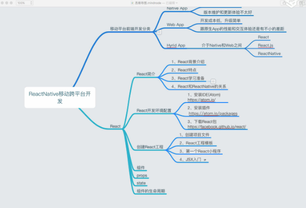
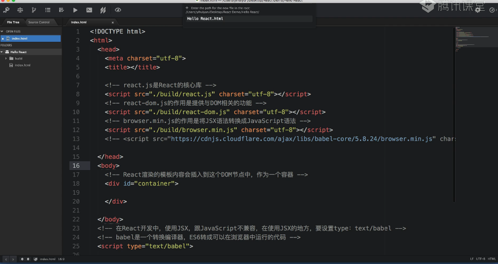

# React基础






### ReactDOM.render()

React的最基本方法，用于将模板转换成HTML语言，渲染DOM,并插入制定的DOM节点中

３个参数
第一个：模板的渲染内容（HTML形式）
第二个：这段模板需要插入的DOM节点（本程序中，是id为container的div节点）
第三个：渲染后的回调，一般不用。

```
import React from 'react';
import ReactDOM from 'react-dom';

ReactDOM.render(
  <h1>Hello React</h1>,　　　//ＪＳＸ语法
  document.getElementById("root")
  )
```
### JSX入门
JSX 不是一门新的语言，是个语法（语法糖）。
1. JSX 必须借助React环境运行
2. JSX标签其实就是HTML标签，只不过我们在JavaScript中书写这些标签的时候，不用使用“”括起来，可以像ＸＭＬ一样书写。
3. 转换：jsx语法能够让我们更直观的看到组件的ＤＯＭ结构，不能直接在浏览器上运行，最终会转换成Ｊａｖａｓｃｒｉｐｔ代码在浏览器中运行。

```
转换ｊａｖａｓｃｒｉｐｔ后的代码


ReactDOM.render(
  React.createElement("h1","null","Hello React"),
  document.getElementById("root")
  );
```
4. 在ＪＳＸ中运行Ｊａｖａｓｃｒｉｐｔ代码。
使用{}括起来｛表达式｝

```
let text = "Jugg";
ReactDOM.render(
  <h1>{text}</h1>,
  document.getElementById("root")
)
```

5. 例如：属性、设置样式、事件绑定


### 定义一个组件

1. React中创建的组件类以大写字母开头，驼峰命名法。
2. 在React中使用Class name extends React.component{}来　　　创建一个组件类
3. 核心代码：每个组件类都必须实现自己的render方法。输出定义好　　的组件模板。返回值：ｎｕｌｌ、ｆａｌｓｅ、组件模板
4. 注意：组件类只能含一个顶层标签

```
import React from "react";
import ReactDOM from "react-dom";

class ShowMessage extends React.component{
  render(){
    return(
      <h1>Hello React</h1>
      )
  }
};

ReactDOM.render(
  在模板中插入<ShowMessage />会自动生成一个实例
  <ShowMessage />,
  document.getElementById("root")
)
```

### 组件样式

设置组件的样式：
1. 内联样式
2. 对象样式
3. 选择器样式

注意：React和HTML5中设置样式时的书写格式是有去呗的
1. HTML5以；结尾
   React，结尾
2. HTML5中 key、value都不加引号
   React中属于JavaScript对象，key的名字不能出现“－”，需要使用驼峰命名法。如果value为字符串，需要加引号。
3. HTML5中，value如果是数字，需要带单位
   React中不需要带单位
注意：在React中使用选择器样式设置组件样式时，属性名不能使用class，需要使用className替换。类似的：使用htmlFor替换for
```
import React from 'react';
import ReactDOM from 'react-dom';

class ShowMessage extends React.Component{
  render(){
    let style = {
      backgroundColor:"green",
      color:"red",

    }
    return(
      <div style = {{backgrundColor:"blue",borderWidth:5,borderStyle:"solid",borderColor:"black"}}>
        <h1 style = {style}>{this.props.firstRow}</h1>
        <p className = "style">{this.props.secondRow}</p>
      </div>
    )
  }
}
```
